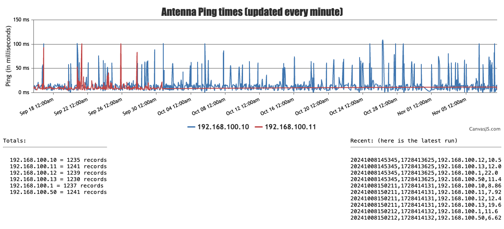
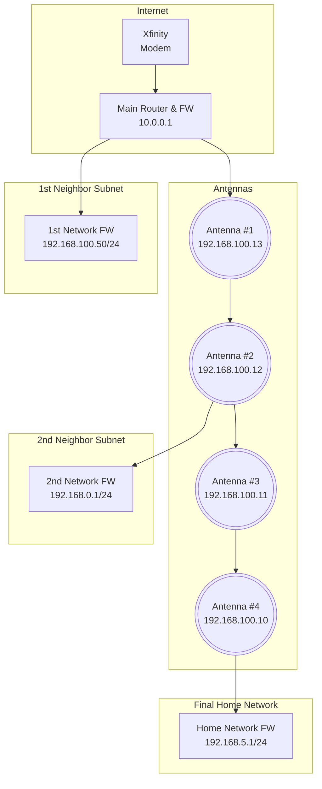

# CheckUp - fping scanning suite
### _A simple yet robust (f)ping server monitoring tool_
Need to ping a several ips/servers (in cron) and view them nicely via a web interface?  Here is a great way to do exactly that, on minimal hardware (like an rpi/android).  I utilize the excellent [canvas.js](https://canvas.js) library for the UI.  I originally needed this to monitor a several WIFI long-range outdoor antennas which would randomly fail, and I never knew which ones were at fault.  This keeps the family happy now that anyone can monitor what's going on.



The goal and implementation is simple:
- Keep the dependencies simple, independent, and something that could run easily on a Raspberry PI (or an old cracked-screen, rooted, Samsung S8+ android cell phone in my basement).
  - For the web interface: Nginx, PHP-fpm, Canvas.js
  - For the ping interface: fping, sed, awk and bash
- Utilize STOCK fping for FAST, efficient pinging (the forks and branches that output CSV are just not sufficient)
- Save to simple, reliable, readable CSV format
- Eventually, compress CSV output (gzip) because we are on small devices and why not?
- Diagram my network (in mermaid mockup, as an example)

## Installation Instructions
For the server ping logging:
1. copy the ```cron``` directory someplace nice (I chose /opt/checkup/cron)
1. edit the ```antennas.ini``` to have whatever IPs you'd like to ping (see my network diagram below as an example)
1. edit the variables in ```cron/checkup.sh``` to point to wherever you decided to install this.
1. run ```crontab -e``` and add ```*/5 * * * * /opt/checkup/cron/checkup.sh``` to run it every 5 minutes (adjust to less or more as your liking).
1. I recommend installing ```vim``` to view the .gz realtime, at this point you've got nice data flowing to start modelling, diagnosing, and maintaining your network...
   Onto the web config portion!

For the pretty web interface:
1. install nginx
1. install php8.2-fpm (earlier versions are probably fine)
1. grab the latest version of canvas.js, from https://github.com/tsur/canvasjs (if needed)
1. copy ```/www``` to your web root directory
1. Hit your server from a browser and enjoy!
   HINT: You can scroll over the graph and even drag and select only the time you want to ZOOM in and focus on - very effective.

## TODO
- [x] ~~Reintroduce the PHP that I lost which generates the dynamic graph from log files...~~
- [ ] Alerting system, maybe via text/email/chat protocols when something is -0
- [ ] Fix code and/or canvas.js legend to show the WHOLE date and time, NOTE just the day when mouseover.
- [ ] Log rolling (although it's fun to let this log get big and watch it still draw out the network diagram.
- [ ] Get this puppy running on a PICO W? Just dare me.

## Network Diagram
My example network to monitor (with a fairly complex topology):

Installation Instructions

