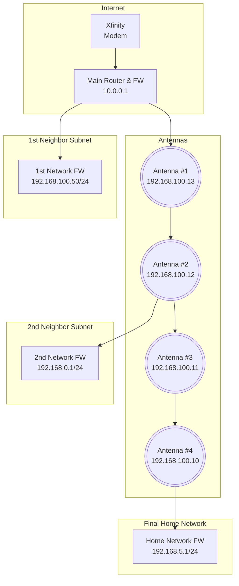

# CheckUp Application
Ping a bunch of ips/servers (in cron) and view them nicely via a web interface.  I originally needed this to monitor a bunch of antennas and not knowing which ones were at fault.

- Utilize STOCK fping for FAST, efficient pinging
- Save to simple, reliable, readable CSV format
- Compress CSV output (gzip)
- Diagram my network (in mermaid mockup, as an example)
  
My example network to monitor (with a fairly complex topology):

